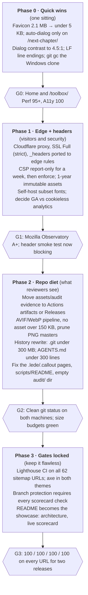

# glee-fully.tools: Flawless GitHub Pages Plan

Oct 1, 2026 · Jamie Hill

## Executive summary

The pipeline is already better than 95% of Pages sites. The site it ships is not.

That's the whole finding. Seven CI workflows, exact-SHA artifact provenance, three-engine browser gates, an allowlisted public inventory. Then the live homepage ships a 1.5 MB favicon and an auto-opening modal that fails contrast on every page.

- **Biggest single defect:** `favicon.svg` is a 2.1 MB Illustrator export wrapping a base64 PNG. It's 1,530 KB of the homepage's 1,811 KB transfer. One file, roughly 85% of page weight.
- **LCP is a dialog, not content.** The "new chapter" transition dialog auto-opens on 59 pages and becomes the Largest Contentful Paint element. Its autofocused button fails WCAG AA at 3.94:1.
- **Lighthouse (mobile, run today):** home 88 / 94 / 100 / 100, `/toolbox/` 66 / 94 / 100 / 100 (Perf / A11y / BP / SEO). Accessibility is capped by that one dialog button.
- **Pages can't deliver your security headers.** `_headers` holds a solid CSP, COOP, CORP and immutable caching. GitHub Pages ignores it; live responses carry `cache-control: max-age=600` and nothing else. The file admits this in its own header comment.
- **Repo hygiene is the hidden tax.** 917 files show as modified on the Windows clone with zero real changes (pure CRLF churn). `.git` is 834 MB with 534 orphaned temp objects. `assets/img` is 194 MB, including 85 images over 1 MB.
- **Governance outweighs product.** `AGENTS.md` is 916 lines, `.agents/` holds 629 tracked files, `assets/audit` ships 23 MB of evidence. Flawless means the reviewer sees the site first, not the paperwork.
- **Recommendation:** stay on GitHub Pages, put Cloudflare's free proxy in front for headers and caching, and run a four-phase hardening program with measurable exit gates. Target: 100 / 100 / 100 / 100 on every page, under 300 KB first load.

## Current state baseline

Measured against `main` at `c264e03d` (PR #62) and the live site on 2026-10-01. Lighthouse numbers ran through a proxy, so treat absolute timings as pessimistic and relative ones as real.

| Area | Finding | Evidence | Severity |
| --- | --- | --- | --- |
| Page weight | `favicon.svg` = 2.1 MB embedded PNG; `favicon.png` = 1.6 MB | `assets/img/favicons/`, Lighthouse network log | Critical |
| Performance | Home 88, `/toolbox/` 66; LCP 3.5 s / 11.5 s; render-blocking savings 610 ms / 2,150 ms | Lighthouse 13 mobile | High |
| Accessibility | Transition dialog close button `#d94f63` on `#fffdfa` = 3.94:1 (needs 4.5:1) | Lighthouse `color-contrast` | High |
| UX | `data-transition-auto` dialog fires on 59 pages, steals LCP and focus | `index.html` line 305 | High |
| Headers | Only HSTS (1 yr, from GitHub) is delivered. CSP is meta-only, so no `frame-ancestors`, no report-to | `curl -I`, `_headers` comment | Medium |
| Caching | Hashed assets (`?v=` tokens) get 10-minute TTL instead of 1 year immutable | `cache-control: max-age=600` | Medium |
| Third parties | Google Fonts (4 families) + GA gtag on 66 pages | HTML scan | Medium |
| Content defects | `.lede` / `.callout` classes still on 3 toolbox pages flagged in the 2026-09-09 audit (verify whether theme.css now defines them) | `grep` on `toolbox/` | Medium |
| Images | 194 MB in `assets/img`; 208 PNG + 270 WebP, no AVIF; 85 files over 1 MB | `du`, `find` | Medium |
| Line endings | 917 files dirty on Windows, all CR/LF only; `.gitattributes` has no `* text=auto eol=lf` | `git diff --ignore-cr-at-eol` = empty | High (process) |
| Repo size | `.git` 834 MB, 534 garbage temp objects | `git count-objects -vH` | Medium |
| Governance mass | `AGENTS.md` 916 lines, `replit.md` 407, `.agents/` 629 files, `docs/` 42, `assets/audit` 23 MB | `git ls-files` | Low (perception) |
| Domain | Apex HTTPS OK, HTTP and `www` 301 to apex, custom 404 returns 404 | `curl` | Good |
| Deploy pipeline | Actions-based Pages deploy, SHA-pinned artifact, tar verified pre-deploy, live header smoke test (advisory) | `pages.yml` | Excellent |
| SEO | 100 on both pages; sitemap (62 URLs), Atom feed, `llms.txt`, robots with AI-crawler rules | Lighthouse, repo | Excellent |

The pattern from the September audit holds. Not systemic rot. Concentrated misses that a strong pipeline isn't catching because its gates measure the wrong thing (a contrast gate that never sees the dialog, a weight budget that doesn't exist).

## Definition of flawless

Flawless is a scorecard, not a vibe. Every line below is machine-checkable and becomes a blocking CI gate, so "flawless" stays true after the next sprint instead of decaying.

| Pillar | Exit criterion | Today | How it's enforced |
| --- | --- | --- | --- |
| Performance | Lighthouse Perf 100 mobile on every sitemap URL; LCP under 1.8 s, CLS under 0.05, TBT under 50 ms | 66 to 88 | Lighthouse CI against the staged artifact, all URLs |
| Weight budget | First load under 300 KB transfer; no single asset over 150 KB; favicon under 5 KB | 1,811 KB | Budget file + artifact size check in `check-pages-artifact.py` |
| Accessibility | Lighthouse A11y 100 and zero axe violations, including every dialog and theme state | 94 | axe-core per page, light + dark, dialog open + closed |
| Best practices / SEO | 100 / 100 maintained; valid JSON-LD; every page in sitemap or explicitly excluded | 100 / 100 | Existing gates, plus structured-data validation |
| Security headers | Mozilla Observatory A+; CSP with `frame-ancestors`, COOP, CORP, Permissions-Policy delivered as real headers | Not delivered | Live header smoke test flips from advisory to blocking |
| Caching | Fingerprinted assets served `max-age=31536000, immutable`; HTML short TTL | 600 s everywhere | Header smoke test asserts per path |
| Privacy | No third-party requests before consent; fonts self-hosted | GA + Google Fonts on load | CSP narrows to `'self'`; network-log gate |
| Resilience | Offline page, SW update path, 404 all pass in 3 engines | Passing | Existing resilience QA (make blocking) |
| Repo hygiene | Clean `git status` on Windows and Linux clone; `.git` under 300 MB; no generated evidence in history | 917 dirty, 834 MB | `.gitattributes` + CI clean-tree check |
| Readability | A new reader understands the repo from `README.md` in 2 minutes; agent docs under 300 lines | 916-line `AGENTS.md` | Line-count lint on governance docs |

One more criterion that doesn't fit a row: the site has to say what it is in five seconds. That's the content bar, and it matters more now that the Custom GPT catalog is pivoting.

## Options

The real decision is how to get headers and caching that GitHub Pages won't serve. Everything else is execution.

| Option | What it is | Pros | Cons | Fit for "flawless Pages example" |
| --- | --- | --- | --- | --- |
| A. Pure Pages, meta-only | Fix weight, a11y, hygiene; keep CSP in `<meta>`; accept 10-min TTL | Zero new vendors; simplest story | Observatory caps around B; no `frame-ancestors` ([MDN](https://developer.mozilla.org/en-US/docs/Web/HTTP/Reference/Headers/Content-Security-Policy/frame-ancestors)); no immutable caching | Honest, but leaves points on the table forever |
| B. Pages + Cloudflare proxy | Same as A, plus Cloudflare free plan in front of `glee-fully.tools` with Transform Rules / Cache Rules carrying `_headers` | Real headers, immutable caching, Brotli, HTTP/3, analytics without GA; `_headers` stops being dead code | One DNS change; Pages cert renewal needs care when proxied; a second system to document | Best. Pages is still the origin and the deploy story is unchanged |
| C. Move to Cloudflare Pages | Deploy the same artifact to Cloudflare Pages, which reads `_headers` natively | Headers file works as-is; preview URLs per PR | It's no longer a GitHub Pages example, which defeats the stated goal | Off-mission |
| D. Add a build step (Eleventy / Astro) | Replace hand-maintained HTML + 143 sync scripts with a static generator | Templates kill duplicated head blocks and CSP hash sprawl (66 hashes today) | Large rewrite; risk to a site that already passes most gates | Right idea, wrong quarter. Revisit after Phase 3 |

Sources: [GitHub Pages limits](https://docs.github.com/en/pages/getting-started-with-github-pages/github-pages-limits) (1 GB recommended repo, 1 GB site, 100 GB/month soft bandwidth).

## Recommendation

Go with Option B. Pages as origin, Cloudflare as the edge, and a four-phase program where each phase ends at a blocking gate.

The reasoning is simple. A "flawless GitHub Pages example" has to stay on GitHub Pages, but it also has to score A+ on headers, and Pages alone can't. Cloudflare's free proxy is the standard answer, costs nothing, and turns your existing `_headers` file from documentation into delivery.

The order matters more than the platform. Fix what visitors feel first (the favicon and the dialog are a single afternoon and take you from 66 to the mid-90s). Then fix what reviewers see (repo hygiene, governance mass). Then lock it with gates so the next ChatGPT or Codex sprint can't regress it.

Don't do Option D yet. A generator is the right long-term move for 76 HTML files with duplicated heads, but it's a rewrite, and you want the scorecard green before you change the engine.

## Phased workplan

No phase starts until the previous gate is green in CI, not on a laptop. Phase 0 alone should move `/toolbox/` from 66 into the 90s.

## Risks and mitigations

| Risk | Likelihood | Impact | Mitigation |
| --- | --- | --- | --- |
| History rewrite (to drop 23 MB of audit evidence and oversized images) breaks forks, PR refs, and the Windows clone | Medium | High | Do it once, in Phase 2, with `git filter-repo` on a fresh mirror; tag `pre-rewrite`; re-clone both machines; announce in CHANGELOG |
| Cloudflare proxy interferes with GitHub's Let's Encrypt renewal | Medium | Medium | Set SSL mode to Full (strict); keep the cert valid before proxying; add a monthly cert-expiry check to the header smoke test |
| Strict CSP breaks GA, Mermaid, or the Universe map | Medium | Medium | Ship as `Content-Security-Policy-Report-Only` for one week, collect reports, then enforce |
| Removing the auto-dialog hides the Custom GPT retirement message (Dec 11, 2026) | Low | Medium | Replace with a static, dismissible banner below the hero; keep the dialog only on `/next-chapter/` |
| Agents (ChatGPT, Codex, Replit) regress the scorecard in the next sprint | High | High | Every scorecard line becomes a required status check; branch protection requires all of them, not 3 of 7 |
| CRLF fix creates one giant noisy commit | Certain | Low | Single "normalize line endings" commit, then add its SHA to `.git-blame-ignore-revs` |
| Self-hosting fonts drifts from brand | Low | Low | Subset only the weights in use (Fredoka 700, Open Sans 400/600, Poppins 500/600, DM Sans 400 to 600); consider dropping one family |

## Next actions

Phase 0 is one sitting. Do it before anything else; it moves the needle more than the rest of the plan combined.

- [ ] Replace `favicon.svg` with a true vector or a 32 px PNG; drop `favicon.png` (1.6 MB); target under 5 KB total
- [ ] Stop `data-transition-auto` on all pages except `/next-chapter/`; swap to an inline banner
- [ ] Fix the dialog button contrast (`#d94f63` needs to darken to roughly `#b83a4e` on `#fffdfa` for 4.5:1, verify with the existing contrast script)
- [ ] Add `* text=auto eol=lf` to `.gitattributes`, renormalize, commit, add the SHA to `.git-blame-ignore-revs`
- [ ] Run `git gc --prune=now` on the Windows clone to clear the 534 orphaned temp objects
- [ ] Re-run Lighthouse on home and `/toolbox/` and record the new baseline

Then, in order: Phase 1 (edge and headers), Phase 2 (repo diet), Phase 3 (gates locked). Details in the roadmap above.

**Follow-ups that would sharpen this plan**

1. Confirm whether you already own Cloudflare DNS for `glee-fully.tools`. That decides whether Phase 1 is a 20-minute or a 2-hour job.
2. Decide whether GA stays. Cloudflare Web Analytics is cookieless and would let CSP collapse to `'self'`.
3. Run a full-sitemap Lighthouse sweep (62 URLs) so the scorecard has a per-page baseline, not two samples.
4. Pick the history-rewrite scope: audit evidence only, or also the 85 images over 1 MB.
5. Decide what `AGENTS.md` becomes: one 300-line contract plus linked detail docs, or a split per agent.
